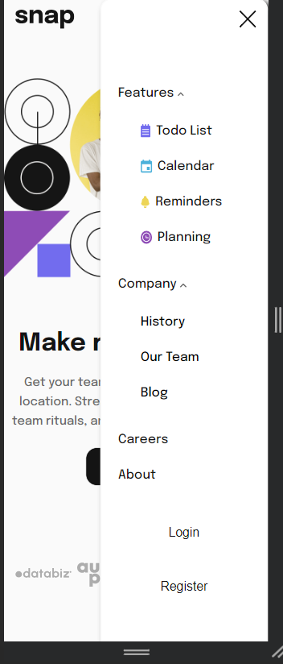

# Frontend Mentor - Intro section with dropdown navigation solution

This is a solution to the [Intro section with dropdown navigation challenge on Frontend Mentor](https://www.frontendmentor.io/challenges/intro-section-with-dropdown-navigation-ryaPetHE5). 

### Screenshot

Desktop

Phone navbar

Phone

### Links

- Solution URL: [Github solution](https://github.com/guillermoanguiano/intro-section-fmio)
- Live Site URL: [site URL here](https://intro-section-fmio.netlify.app/)

## My process

### Built with

- Semantic HTML5 markup
- CSS custom properties
- [React](https://reactjs.org/) - JS library

### Continued development

I think my JS is stronger than my CSS, so I'd to improve my CSS 

## Author

- Website - [Guillermo's GitHub](https://github.com/guillermoanguiano)
- Frontend Mentor - [@rutx1](https://www.frontendmentor.io/profile/rutx1)
- Twitter - [@1anguiano1](https://twitter.com/1anguiano1)

